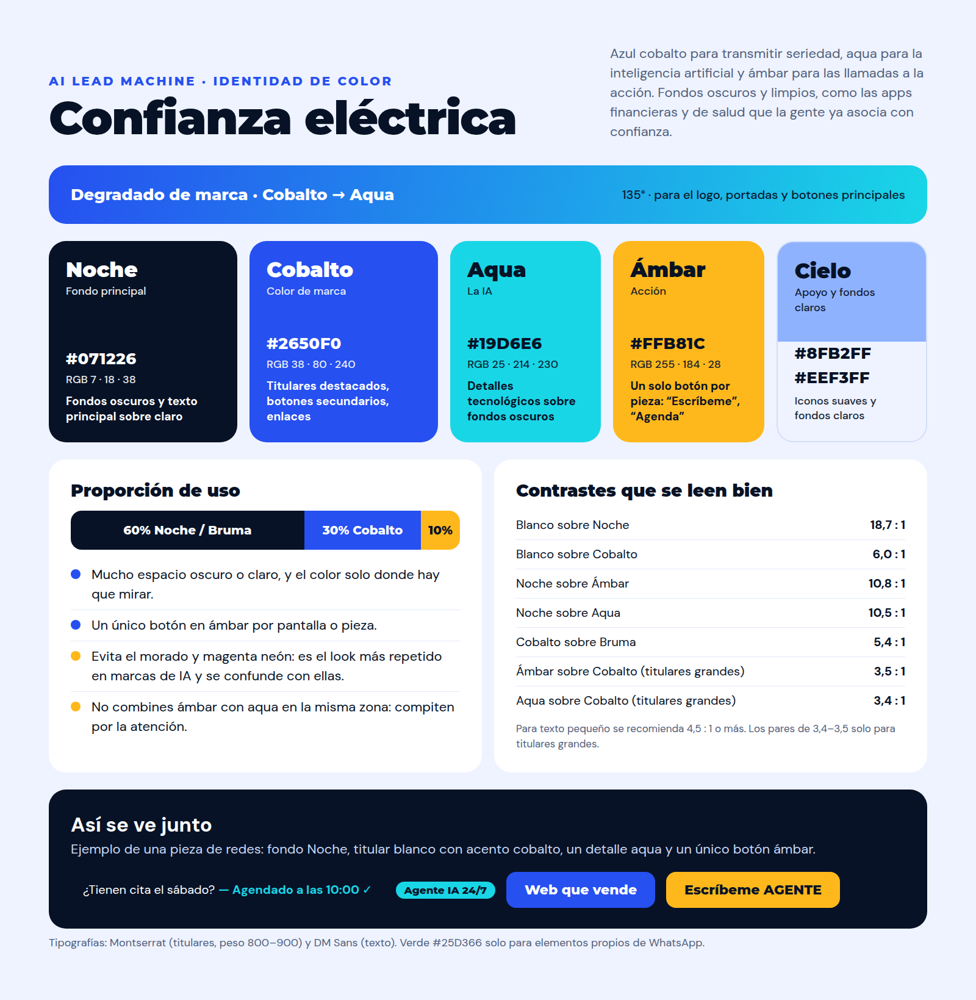

# Paleta AI Lead Machine: "Confianza eléctrica"



| Nombre | Hex | Uso |
|---|---|---|
| Noche | `#071226` | Fondos oscuros y texto principal sobre claro |
| Cobalto | `#2650F0` | Color de marca: titulares destacados, botones secundarios |
| Aqua | `#19D6E6` | La IA: detalles tecnológicos sobre fondos oscuros |
| Ámbar | `#FFB81C` | Llamadas a la acción (un botón por pieza) |
| Cielo / Bruma | `#8FB2FF` / `#EEF3FF` | Iconos suaves y fondos claros |

Degradado de marca: `linear-gradient(135deg, #2650F0, #19D6E6)`.
Tipografías: Montserrat 800–900 (titulares) y DM Sans (texto).
Verde `#25D366` solo para elementos propios de WhatsApp.

## Tokens CSS
```css
:root{--ink:#071226;--cobalt:#2650F0;--aqua:#19D6E6;--amber:#FFB81C;--sky:#8FB2FF;--paper:#EEF3FF}
```

## Pendiente
El logo de la "A" sigue en morado y magenta. Para recolorearlo con esta paleta hace falta el archivo original (SVG o PNG con fondo transparente).
